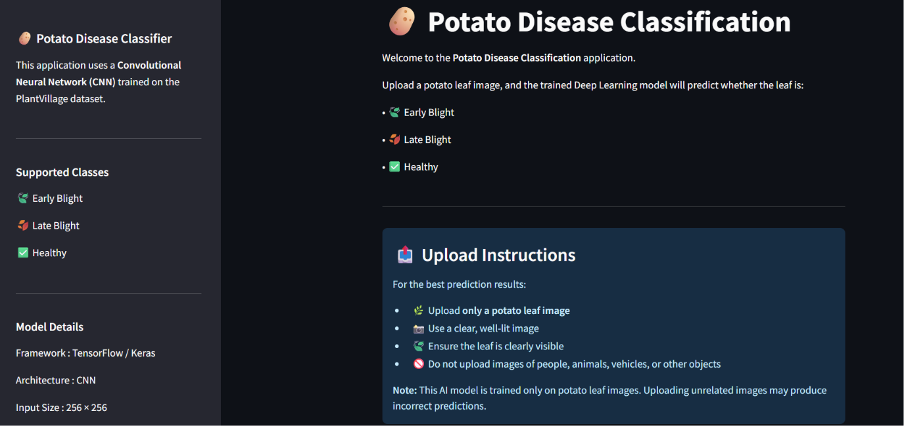
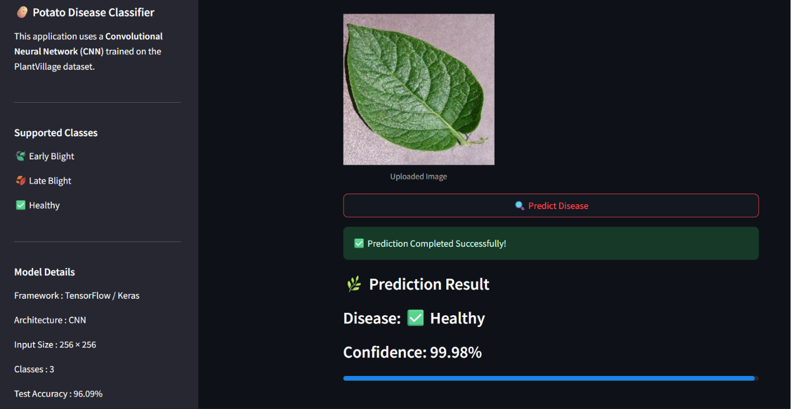
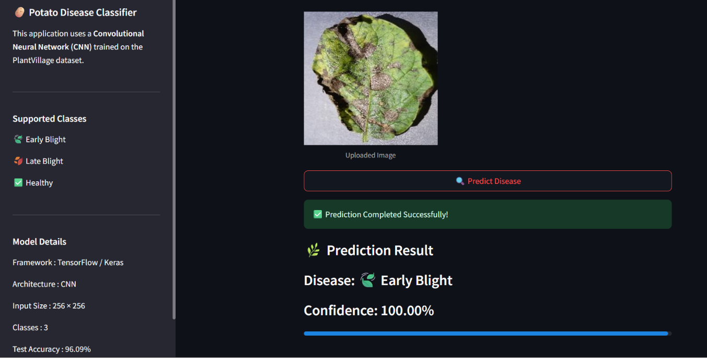
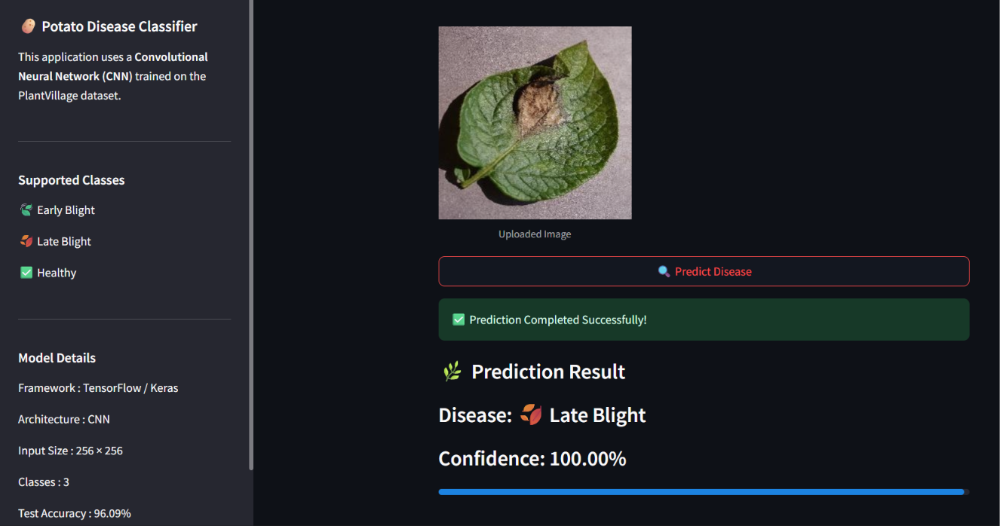

# 🥔 Potato Disease Classification using Deep Learning

A Deep Learning based web application that classifies potato leaf diseases from uploaded images using a Convolutional Neural Network (CNN). The application is built with TensorFlow/Keras and deployed using Streamlit Community Cloud.

---

## 🚀 Live Demo

🌐 https://potato-disease-classification-cnn-5j3xqmnsnmvqbqg8z7tqja.streamlit.app/

---

## 📌 Project Overview

Potato diseases can significantly reduce crop yield if not identified early.

This project uses a Convolutional Neural Network (CNN) trained on potato leaf images to classify leaves into three categories:

- 🍃 Early Blight
- 🍂 Late Blight
- ✅ Healthy

The trained model is integrated into a Streamlit web application that allows users to upload an image and receive an instant prediction with confidence.

---

## ✨ Features

- Image Upload Interface
- Real-time Disease Prediction
- Confidence Score
- CNN-based Deep Learning Model
- TensorFlow/Keras Implementation
- Clean Streamlit UI
- Live Cloud Deployment

---

## 📊 Model Performance

| Metric | Value |
|---------|--------|
| Test Accuracy | **98.28%** |
| Classes | 3 |
| Framework | TensorFlow |
| Deployment | Streamlit Community Cloud |

---

## 🧠 Disease Classes

- Potato___Early_blight
- Potato___Late_blight
- Potato___healthy

---

## 🛠 Tech Stack

- Python
- TensorFlow
- Keras
- NumPy
- Pillow
- Streamlit
- Git
- GitHub

---

## 📁 Project Structure

```
Potato-Disease-Classification-CNN/
│
├── app.py
├── requirements.txt
├── runtime.txt
├── README.md
│
├── models/
│   ├── best_model.keras
│   └── class_names.json
│
└── images/
     ├── home.png
     ├── healthy.png
     ├── early_blight.png
     ├── late_blight.png

```

---

## ⚙️ Installation

Clone the repository

```bash
git clone https://github.com/Princeg1204/potato-disease-classification-cnn.git
```

Move into the project

```bash
cd potato-disease-classification-cnn
```

Install dependencies

```bash
pip install -r requirements.txt
```

Run the application

```bash
streamlit run app.py
```

---

## 📷 Application Preview

### Home Page



### Healthy Prediction



### Early Blight Prediction



### Late Blight Prediction



---

## 🔮 Future Improvements

- FastAPI Backend
- Docker Deployment
- Mobile Responsive UI
- Disease Treatment Recommendations
- Multi-language Support
- Batch Image Prediction

---

## 👨‍💻 Author

**Prince Gajera**

GitHub:
https://github.com/Princeg1204

LinkedIn:
https://www.linkedin.com/in/princegajera/

---

⭐ If you found this project useful, consider giving it a star.
